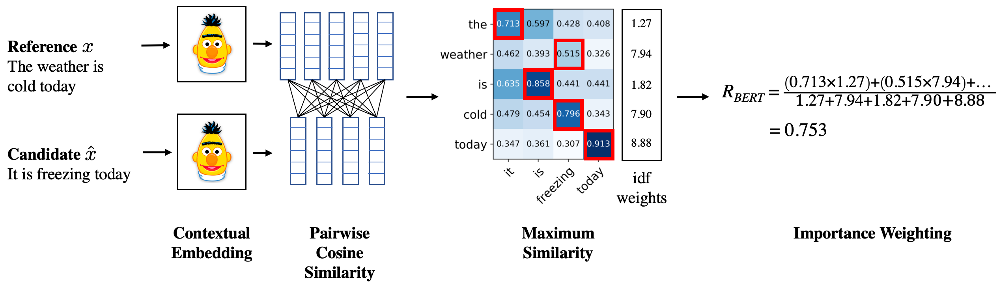

# BERTScore
[](#python)
[](https://arxiv.org/abs/1904.09675)
[](https://pypi.python.org/pypi/bert-score/) [](https://pepy.tech/project/bert-score) [](https://pepy.tech/project/bert-score) [](https://opensource.org/licenses/MIT) 
[](https://github.com/psf/black) 


Automatic Evaluation Metric described in the paper [BERTScore: Evaluating Text Generation with BERT](https://arxiv.org/abs/1904.09675) (ICLR 2020). We now support about 130 models (see this [spreadsheet](https://docs.google.com/spreadsheets/d/1RKOVpselB98Nnh_EOC4A2BYn8_201tmPODpNWu4w7xI/edit?usp=sharing) for their correlations with human evaluation). Currently, the best model is `microsoft/deberta-xlarge-mnli`, please consider using it instead of the default `roberta-large` in order to have the best correlation with human evaluation.

#### News:
<!-- - Features to appear in the next version (currently in the master branch): -->
- Updated to version 0.3.12
  - Having `get_idf_dict` compatible with DDP ([#140](https://github.com/Tiiiger/bert_score/pull/140))
  - Fix setup bug ([#138](https://github.com/Tiiiger/bert_score/pull/138))
- Updated to version 0.3.11
  - Support 6 DeBERTa v3 models
  - Support 3 ByT5 models
- Updated to version 0.3.10
  - Support 8 SimCSE models
  - Fix the support of scibert (to be compatible with transformers >= 4.0.0)
  - Add scripts for reproducing some results in our paper (See this [folder](./reproduce))
  - Support fast tokenizers in huggingface transformers with `--use_fast_tokenizer`. Notably, you will get different scores because of the difference in the tokenizer implementations ([#106](https://github.com/Tiiiger/bert_score/issues/106)). 
  - Fix non-zero recall problem for empty candidate strings ([#107](https://github.com/Tiiiger/bert_score/issues/107)).
  - Add Turkish BERT Supoort ([#108](https://github.com/Tiiiger/bert_score/issues/108)).
- Updated to version 0.3.9
  - Support 3 BigBird models
  - Fix bugs for mBART and T5
  - Support 4 mT5 models as requested ([#93](https://github.com/Tiiiger/bert_score/issues/93))
- Updated to version 0.3.8
  - Support 53 new pretrained models including BART, mBART, BORT, DeBERTa, T5, BERTweet, MPNet, ConvBERT, SqueezeBERT, SpanBERT, PEGASUS, Longformer, LED, Blendbot, etc. Among them, DeBERTa achives higher correlation with human scores than RoBERTa (our default) on WMT16 dataset. The correlations are presented in this [Google sheet](https://docs.google.com/spreadsheets/d/1RKOVpselB98Nnh_EOC4A2BYn8_201tmPODpNWu4w7xI/edit?usp=sharing).
  - Please consider using `--model_type microsoft/deberta-xlarge-mnli` or `--model_type microsoft/deberta-large-mnli` (faster) if you want the scores to correlate better with human scores.
  - Add baseline files for DeBERTa models.
  - Add example code to generate baseline files (please see the [details](get_rescale_baseline)).
- Updated to version 0.3.7
  - Being compatible with Huggingface's transformers version >=4.0.0. Thanks to public contributers ([#84](https://github.com/Tiiiger/bert_score/pull/84), [#85](https://github.com/Tiiiger/bert_score/issues/85), [#86](https://github.com/Tiiiger/bert_score/pull/86)).
- See [#22](https://github.com/Tiiiger/bert_score/issues/22) if you want to replicate our experiments on the COCO Captioning dataset.


- For people in China, downloading pre-trained weights can be very slow. We provide copies of a few models on Baidu Pan.
  - [roberta-large](https://pan.baidu.com/s/1MTmGHsZ3ubn7Vr_W-wyEdQ) password: dhe5
  - [bert-base-chinese](https://pan.baidu.com/s/1THfiCXjWtdGGsCMskQ5svA) password: jvk7
  - [bert-base-multilingual-cased](https://pan.baidu.com/s/100SBjkLmI7U4pgo_e0q7CQ) password: yx3q
- [Huggingface's datasets](https://github.com/huggingface/datasets) library includes BERTScore in their metric collection.

<details><summary>Previous updates</summary><p>

- Updated to version 0.3.6
  - Support custom baseline files [#74](https://github.com/Tiiiger/bert_score/pull/74)
  - The option `--rescale-with-baseline` is changed to `--rescale_with_baseline` so that it is consistent with other options.
- Updated to version 0.3.5
  - Being compatible with Huggingface's transformers >=v3.0.0 and minor fixes ([#58](https://github.com/Tiiiger/bert_score/pull/58), [#66](https://github.com/Tiiiger/bert_score/pull/66), [#68](https://github.com/Tiiiger/bert_score/pull/68))
  - Several improvements related to efficency ([#67](https://github.com/Tiiiger/bert_score/pull/67), [#69](https://github.com/Tiiiger/bert_score/pull/69))
- Updated to version 0.3.4
  - Compatible with transformers v2.11.0 now (#58)
- Updated to version 0.3.3
  - Fixing the bug with empty strings [issue #47](https://github.com/Tiiiger/bert_score/issues/47).
  - Supporting 6 [ELECTRA](https://github.com/google-research/electra) models and 24 smaller [BERT](https://github.com/google-research/bert) models.
  - A new [Google sheet](https://docs.google.com/spreadsheets/d/1RKOVpselB98Nnh_EOC4A2BYn8_201tmPODpNWu4w7xI/edit?usp=sharing) for keeping the performance (i.e., pearson correlation with human judgment) of different models on WMT16 to-English.
  - Including the script for tuning the best number of layers of an English pre-trained model on WMT16 to-English data (See the [details](tune_layers)).
- Updated to version 0.3.2
  - **Bug fixed**: fixing the bug in v0.3.1 when having multiple reference sentences.
  - Supporting multiple reference sentences with our command line tool.
- Updated to version 0.3.1
  - A new `BERTScorer` object that caches the model to avoid re-loading it multiple times. Please see our [jupyter notebook example](./example/Demo.ipynb) for the usage.
  - Supporting multiple reference sentences for each example. The `score` function now can take a list of lists of strings as the references and return the score between the candidate sentence and its closest reference sentence.

</p></details>

Please see [release logs](https://github.com/Tiiiger/bert_score/releases) for older updates.

#### Authors:
* [Tianyi Zhang](https://scholar.google.com/citations?user=OI0HSa0AAAAJ&hl=en)*
* [Varsha Kishore](https://scholar.google.com/citations?user=B8UeYcEAAAAJ&authuser=2)*
* [Felix Wu](https://sites.google.com/view/felixwu/home)*
* [Kilian Q. Weinberger](http://kilian.cs.cornell.edu/index.html)
* [Yoav Artzi](https://yoavartzi.com/)

*: Equal Contribution

### Overview
BERTScore leverages the pre-trained contextual embeddings from BERT and matches
words in candidate and reference sentences by cosine similarity.
It has been shown to correlate with human judgment on sentence-level and
system-level evaluation.
Moreover, BERTScore computes precision, recall, and F1 measure, which can be
useful for evaluating different language generation tasks.

For an illustration, BERTScore recall can be computed as


If you find this repo useful, please cite:
```
@inproceedings{bert-score,
  title={BERTScore: Evaluating Text Generation with BERT},
  author={Tianyi Zhang* and Varsha Kishore* and Felix Wu* and Kilian Q. Weinberger and Yoav Artzi},
  booktitle={International Conference on Learning Representations},
  year={2020},
  url={https://openreview.net/forum?id=SkeHuCVFDr}
}
```

### Installation
* Python version >= 3.6
* PyTorch version >= 1.0.0

Install from pypi with pip by 

```sh
pip install bert-score
```
Install latest unstable version from the master branch on Github by:
```
pip install git+https://github.com/Tiiiger/bert_score
```

Install it from the source by:
```sh
git clone https://github.com/Tiiiger/bert_score
cd bert_score
pip install .
```
and you may test your installation by:
```
python -m unittest discover
```

### Usage


#### Python Function

On a high level, we provide a python function `bert_score.score` and a python object `bert_score.BERTScorer`.
The function provides all the supported features while the scorer object caches the BERT model to faciliate multiple evaluations.
Check our [demo](./example/Demo.ipynb) to see how to use these two interfaces. 
Please refer to [`bert_score/score.py`](./bert_score/score.py) for implementation details.

Running BERTScore can be computationally intensive (because it uses BERT :p).
Therefore, a GPU is usually necessary. If you don't have access to a GPU, you
can try our [demo on Google Colab](https://colab.research.google.com/drive/1kpL8Y_AnUUiCxFjhxSrxCsc6-sDMNb_Q)

#### Command Line Interface (CLI)
We provide a command line interface (CLI) of BERTScore as well as a python module. 
For the CLI, you can use it as follows:
1. To evaluate English text files:

We provide example inputs under `./example`.

```sh
bert-score -r example/refs.txt -c example/hyps.txt --lang en
```
You will get the following output at the end:

roberta-large_L17_no-idf_version=0.3.0(hug_trans=2.3.0) P: 0.957378 R: 0.961325 F1: 0.959333

where "roberta-large_L17_no-idf_version=0.3.0(hug_trans=2.3.0)" is the hash code.

Starting from version 0.3.0, we support rescaling the scores with baseline scores

```sh
bert-score -r example/refs.txt -c example/hyps.txt --lang en --rescale_with_baseline
```
You will get:

roberta-large_L17_no-idf_version=0.3.0(hug_trans=2.3.0)-rescaled P: 0.747044 R: 0.770484 F1: 0.759045 

This makes the range of the scores larger and more human-readable. Please see this [post](./journal/rescale_baseline.md) for details.

When having multiple reference sentences, please use
```sh
bert-score -r example/refs.txt example/refs2.txt -c example/hyps.txt --lang en
```
where the `-r` argument supports an arbitrary number of reference files. Each reference file should have the same number of lines as your candidate/hypothesis file. The i-th line in each reference file corresponds to the i-th line in the candidate file.


2. To evaluate text files in other languages:

We currently support the 104 languages in multilingual BERT ([full list](https://github.com/google-research/bert/blob/master/multilingual.md#list-of-languages)).

Please specify the two-letter abbreviation of the language. For instance, using `--lang zh` for Chinese text. 

See more options by `bert-score -h`.


3. To load your own custom model:
Please specify the path to the model and the number of layers to use by `--model` and `--num_layers`.
```sh
bert-score -r example/refs.txt -c example/hyps.txt --model path_to_my_bert --num_layers 9
```


4. To visualize matching scores:
```sh
bert-score-show --lang en -r "There are two bananas on the table." -c "On the table are two apples." -f out.png
```
The figure will be saved to out.png.


#### Practical Tips

* Report the hash code (e.g., `roberta-large_L17_no-idf_version=0.3.0(hug_trans=2.3.0)-rescaled`) in your paper so that people know what setting you use. This is inspired by [sacreBLEU](https://github.com/mjpost/sacreBLEU). Changes in huggingface's transformers version may also affect the score (See [issue #46](https://github.com/Tiiiger/bert_score/issues/46)).
* Unlike BERT, RoBERTa uses GPT2-style tokenizer which creates addition " " tokens when there are multiple spaces appearing together. It is recommended to remove addition spaces by `sent = re.sub(r' +', ' ', sent)` or `sent = re.sub(r'\s+', ' ', sent)`.
* Using inverse document frequency (idf) on the reference
  sentences to weigh word importance  may correlate better with human judgment.
  However, when the set of reference sentences become too small, the idf score 
  would become inaccurate/invalid.
  We now make it optional. To use idf,
  please set `--idf` when using the CLI tool or
  `idf=True` when calling `bert_score.score` function.
* When you are low on GPU memory, consider setting `batch_size` when calling
  `bert_score.score` function.
* To use a particular model please set `-m MODEL_TYPE` when using the CLI tool
  or `model_type=MODEL_TYPE` when calling `bert_score.score` function. 
* We tune layer to use based on WMT16 metric evaluation dataset. You may use a
  different layer by setting `-l LAYER` or `num_layers=LAYER`. To tune the best layer for your custom model, please follow the instructions in [tune_layers](tune_layers) folder.
* __Limitation__: Because BERT, RoBERTa, and XLM with learned positional embeddings are pre-trained on sentences with max length 512, BERTScore is undefined between sentences longer than 510 (512 after adding \[CLS\] and \[SEP\] tokens). The sentences longer than this will be truncated. Please consider using XLNet which can support much longer inputs.

### Default Behavior

#### Default Model
| Language  | Model                            |
|:---------:|:--------------------------------:|
| en        | roberta-large                    |
| en-sci    | allenai/scibert_scivocab_uncased |
| zh        | bert-base-chinese                |
| tr        | dbmdz/bert-base-turkish-cased    |
| others    | bert-base-multilingual-cased     |

#### Default Layers
Please see this [Google sheet](https://docs.google.com/spreadsheets/d/1RKOVpselB98Nnh_EOC4A2BYn8_201tmPODpNWu4w7xI/edit?usp=sharing) for the supported models and their performance.

### Acknowledgement
This repo wouldn't be possible without the awesome
[bert](https://github.com/google-research/bert), [fairseq](https://github.com/pytorch/fairseq), and [transformers](https://github.com/huggingface/transformers).
