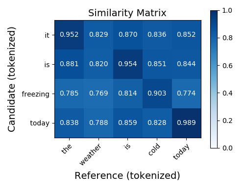
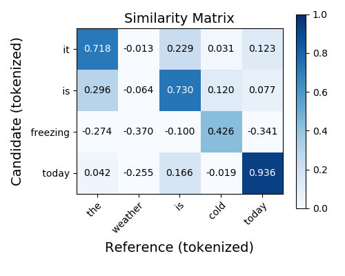

# Rescaling BERTScore with Baselines

BERTScore computes a sentence-level similarity score by making use of token-level similarities, 
produced by cosine similarities between contextual embeddings. 
The numerical range of BERTScore is between -1 and 1, the same as the underlying cosine similarity.
In practice, however, BERTscore is usually found to be in a small range. 
For an extreme case, BERTScore computed with the large RoBERTa model often is between 0.85 and 0.95.

Although BERTscore correlates highly with human judgment in spite of the above mentioned caveat, BERTScore will
be easier to interpret and work with if it has a natural range (for example, between 0 and 1).
Therefore, we seek a method to rescale BERTScore to have an intuitive range.
Let's denote the BERTScore for a pair of candidate and reference sentence as 
Let  be a lower bound for BERTScores that we typically observe in practice (i.e. ).
We obtain a rescaled BERTScore  through a simple linear transformation, 
.
With a reliable baseline , we will typically observe  to be between 0 and 1.

We highlight that this rescaling operation does not affect BERTScore's correlation with human judgment, as measured by Pearson's  and Kendall's  coefficients. So we preserve BERTScore's high correlation as reported in our [study](https://arxiv.org/abs/1904.09675).
We now describe how we compute a reliable baseline.

For each language, we select a million sentences from some large monolingual corpus.
We randomly group sentences into candidate-reference pairs, resulting in half a million pairs.
For each contextual embedding model, we compute BERTScore on the random pairs and take the average to be the baseline.
We compute the baseline with different layers of representations and separate the baselines for precision, recall, and F1.
So far, we have supported 11 different languages (English, Chinese, French, German...) with all models we support.
The baseline numbers are collected [here](../rescale_baseline). We plan to release the experiment code soon so you can compute baselines with any data of your choice.

With this recalling, the average BERTScore (computed with RoBERTa-large, layer17) on the WMT18 De-EN translation evaluation dataset drops from 0.9311 to 0.5758.
For a concrete example, we can plot the similarity matrix between two sentences using `bert-score-show`.

Before scaling:



After scaling:



Clearly, the rescaling produces a more readable output. Occationally, some of the similarity entries will become negative after rescaling but they won't affect BERTScore results because the rescaling is done after BERTScore is computed. 

We package this feature into our library (>=0.3.0). Here's an example on how to use it (note that the language needs to be specified in order to use this feature):
```python
out = bert_score.score(
    cands, refs, 
    rescale_with_baseline=True, lang="en"
)
```
and for the command-line version:
```bash
bert-score -r example/refs.txt -c example/hyps.txt \
           --lang en --rescale_with_baseline
```


Hope you enjoy this new feature!

---Tianyi, Varsha, and Felix
